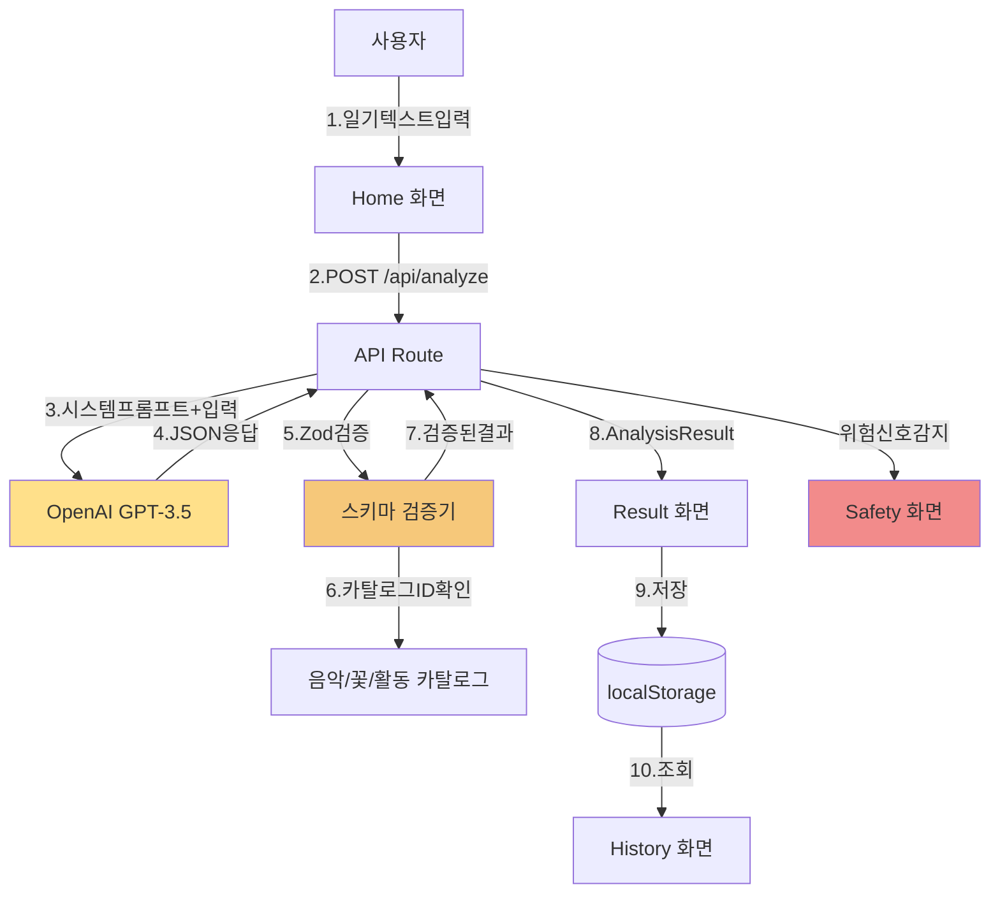

# 아띠(Atti) 코드 아키텍처

> **시니어 풀스택 엔지니어 + 아키텍트 + DevRel 관점**  
> 대상 독자: 개발을 거의 모르는 기획자  
> 목표: 2시간 이내 MVP 구현 가능한 구체적 설계

**버전**: v1.0  
**작성일**: 2026-01-22  
**기준**: 최신 stable 스택 (2026-01 검증)

---

## 목차
1. [한눈에 보는 결론 (1페이지 요약)](#1-한눈에-보는-결론-1페이지-요약)
2. [제품 요구사항 매핑 (화면/기능 → 코드 모듈)](#2-제품-요구사항-매핑-화면기능--코드-모듈)
3. [기술 스택 (최신 stable 버전)](#3-기술-스택-최신-stable-버전)
4. [리포지토리 구조 (폴더 트리)](#4-리포지토리-구조-폴더-트리)
5. [데이터 모델 (타입/스키마)](#5-데이터-모델-타입스키마)
6. [API 설계 (서버 라우트)](#6-api-설계-서버-라우트)
7. [프롬프트/환각 방지 설계](#7-프롬프트환각-방지-설계)
8. [UI 상태 설계 (로딩/빈상태/오류/완료)](#8-ui-상태-설계-로딩빈상태오류완료)
9. [보안/프라이버시/안전](#9-보안프라이버시안전)
10. [배포 (Vercel) 체크리스트](#10-배포-vercel-체크리스트)
11. [2시간 구현 플랜 (분 단위 타임박스)](#11-2시간-구현-플랜-분-단위-타임박스)
12. [후속 확장 로드맵](#12-후속-확장-로드맵)

---

## 1. 한눈에 보는 결론 (1페이지 요약)

### 1-1. MVP 스택 선택 (왜 이 조합인가?)

| 항목 | 선택 | 이유 (2시간 제약) |
|------|------|------------------|
| **프레임워크** | Next.js 16.1.2 | App Router로 클라/서버 한 프로젝트, Vercel 최적화, 학습자료 최다 |
| **언어** | TypeScript 5.9.3 | 컴파일 타임 에러 99% 방지, 런타임 버그 최소화 |
| **스타일** | Tailwind 4.1.18 | CSS 파일 불필요, utility 클래스로 빠른 프로토타이핑 |
| **UI** | shadcn/ui 3.6.3 | 복붙 가능한 컴포넌트, 커스터마이징 쉬움 |
| **저장** | localStorage | 서버/DB 없이 즉시 작동, JSON export로 백업 |
| **LLM** | OpenAI SDK 5.19.1 | 안정적 API, GPT-3.5-turbo로 비용 최소 |
| **검증** | Zod 4.2.0 | 런타임 스키마 검증, 환각 방지 핵심 |
| **차트** | Recharts 3.7.0 | 경량, 선언적, React 19 호환 |
| **배포** | Vercel | Next.js 제작사, 무료, 5분 배포, 자동 HTTPS |

**핵심 트레이드오프**:
- ✅ **빠름**: 서버리스 아키텍처, 별도 백엔드 불필요
- ✅ **저렴**: 월 사용자 100명 기준 ~$5 (OpenAI API만)
- ⚠️ **제약**: 로컬 저장 → 기기별 데이터 분리 (백업 필수 안내)

### 1-2. 데이터 흐름 다이어그램



**흐름 설명**:
1. 사용자가 Home에서 일기 입력
2. 클라이언트가 `/api/analyze`로 POST (서버 라우트)
3. 서버가 OpenAI API 호출 (API 키는 서버에만 존재)
4. JSON 형식으로 감정/요약/액션 반환
5. **Zod로 스키마 검증** (필수 필드/타입 확인)
6. **카탈로그 ID가 실존하는지 확인** (환각 방지)
7. 검증 통과 시 결과 반환
8. Result 화면에 표시 (감정 배지/공감/조언/액션 카드)
9. localStorage에 저장 (JournalEntry)
10. History에서 기록 목록 표시

**위험 신호 감지 시**: 일반 응답 중단 → Safety 화면 즉시 전환 → 1393 노출

---

## 2. 제품 요구사항 매핑 (화면/기능 → 코드 모듈)

### 2-1. Home (일기 작성)

**필요한 컴포넌트**:
- `JournalInput.tsx`: 큰 텍스트 영역 (Textarea)
- `ConditionSelect.tsx`: 수면/식사/활동 선택 (Select)
- `TagInput.tsx`: #학교 #연애 #가족 태그 (Multi-select)
- `IntensitySlider.tsx`: 0~5 감정 강도 (Slider)
- `SubmitButton.tsx`: "아띠에게 보내기" (Button with loading)

**필요한 상태 (useState)**:
- `journalText`: string (일기 본문)
- `condition`: { sleep, meal, activity } | null
- `tags`: string[]
- `intensity`: number (0~5)
- `isSubmitting`: boolean
- `error`: string | null

**필요한 API**:
- `POST /api/analyze` (일기 제출)

**저장되는 데이터**:
- 없음 (일기 원문은 서버에서 분석 후 즉시 삭제, Result에서만 저장)

---

### 2-2. Result (분석 결과)

**필요한 컴포넌트**:
- `EmotionBadge.tsx`: SVG 기반 감정 배지 (public/atti/emotions/*.svg)
- `SummaryBlock.tsx`: 1~3줄 핵심 요약
- `ResponseSection.tsx`: 공감/조언 메시지
- `ActionCard.tsx`: 음악/꽃/활동 카드
- `EvidenceCard.tsx`: 근거 출처 표시
- `SaveButton.tsx`: "기록에 저장" (localStorage)

**필요한 상태**:
- `analysisResult`: AnalysisResult | null
- `isSaving`: boolean

**필요한 API**:
- 없음 (Result는 Home에서 받은 데이터 표시)

**저장되는 데이터**:
- `JournalEntry` (localStorage에 저장)
  - id, createdAt, text, emotions, summary, response, actions

---

### 2-3. History (기록)

**필요한 컴포넌트**:
- `EntryCard.tsx`: 날짜 + 한 줄 요약 + 주요 감정 배지
- `DetailModal.tsx`: 클릭 시 전체 내용 표시

**필요한 상태**:
- `entries`: JournalEntry[]
- `selectedEntry`: JournalEntry | null

**필요한 API**:
- 없음 (localStorage에서 조회)

**저장되는 데이터**:
- 읽기 전용 (localStorage 조회)

---

### 2-4. Safety (위기 안내)

**필요한 컴포넌트**:
- `EmergencyContact.tsx`: 1393 전화 버튼 (큰 터치 영역)
- `ResourceList.tsx`: 정신건강복지센터 안내
- `CalmGuide.tsx`: "지금 할 수 있는 것 3가지"
- `DisclaimerText.tsx`: 면책 문구 (작은 글씨)

**필요한 상태**:
- 없음 (정적 콘텐츠)

**필요한 API**:
- 없음

**저장되는 데이터**:
- 없음

---

### 2-5. Settings (설정)

**필요한 컴포넌트**:
- `BackupButton.tsx`: JSON 파일 다운로드 (Blob → download)
- `RestoreButton.tsx`: JSON 파일 업로드 (FileReader)
- `DeleteButton.tsx`: 전체 삭제 (확인 모달 필수)
- `PolicyLink.tsx`: 개인정보 처리방침 링크

**필요한 상태**:
- `isBackingUp`: boolean
- `isRestoring`: boolean
- `showDeleteModal`: boolean

**필요한 API**:
- 없음 (localStorage 직접 조작)

**저장되는 데이터**:
- 백업: localStorage 전체 → JSON 파일
- 복원: JSON 파일 → localStorage

---

## 3. 기술 스택 (최신 stable 버전)

**2026-01-22 기준, 공식 소스 확인 완료**

| 카테고리 | 도구 | 버전 | 출처/이유 |
|----------|------|------|-----------|
| **Runtime** | Node.js | **24.13.0 LTS** | Active LTS (2026-10까지), v24.13.0 (2026-01-13 릴리즈) |
| **패키지 매니저** | npm | (Node 포함) | Next.js 공식 권장 (pnpm/yarn도 가능) |
| **프레임워크** | Next.js | **16.1.2** | App Router 안정화, 2025-12-11 릴리즈 |
| **언어** | TypeScript | **5.9.3** | 최신 stable (6.0 아직 RC), 2025-12 릴리즈 |
| **React** | React | **19.2.3** | Next.js 16과 호환, 2025-12-11 릴리즈 |
| **스타일** | Tailwind CSS | **4.1.18** | v4 stable, 2025-12-11 릴리즈 |
| **UI** | shadcn/ui | **3.6.3** | 2026-01-06 릴리즈, Radix/Base UI 지원 |
| **검증** | Zod | **4.2.0** | 런타임 스키마 검증, 2025-12-15 릴리즈 |
| **LLM SDK** | openai | **5.19.1** | 공식 Node SDK, 2026-01-20 릴리즈 (2일 전) |
| **차트** | Recharts | **3.7.0** | React 19 호환, 경량 선언적 차트 |
| **날짜** | date-fns | **3.x** | 경량 날짜 유틸 (moment 대체) |
| **린트** | ESLint | **9.39.2** | v10은 아직 RC, 2026-01 릴리즈 |
| **포맷** | Prettier | **3.8.0** | 2026-01-14 릴리즈 |
| **배포** | Vercel | - | Next.js 제작사, 무료 플랜 충분 |

**상태 관리**: useState + useContext (최소 원칙, Zustand/Redux 불필요)

---

## 4. 리포지토리 구조 (폴더 트리)

```
atti-app/
├── app/                          # Next.js App Router
│   ├── page.tsx                  # Home (일기 작성)
│   ├── result/
│   │   └── page.tsx              # Result (분석 결과)
│   ├── history/
│   │   └── page.tsx              # History (기록)
│   ├── safety/
│   │   └── page.tsx              # Safety (위기 안내)
│   ├── settings/
│   │   └── page.tsx              # Settings (백업/복원)
│   ├── api/
│   │   └── analyze/
│   │       └── route.ts          # POST /api/analyze (LLM 호출)
│   ├── layout.tsx                # 전역 레이아웃 (폰트/메타)
│   ├── globals.css               # Tailwind 진입점
│   ├── error.tsx                 # 에러 바운더리
│   └── not-found.tsx             # 404 페이지
│
├── components/                   # UI 컴포넌트
│   ├── journal-input.tsx         # 일기 입력 폼
│   ├── emotion-badge.tsx         # 감정 배지 (SVG)
│   ├── action-card.tsx           # 액션 아이템 카드
│   ├── music-card.tsx            # 음악 추천 카드
│   ├── entry-card.tsx            # 기록 카드
│   ├── loading-skeleton.tsx     # 로딩 UI
│   └── ui/                       # shadcn/ui 컴포넌트
│       ├── button.tsx
│       ├── card.tsx
│       ├── textarea.tsx
│       ├── select.tsx
│       ├── slider.tsx
│       ├── badge.tsx
│       └── toast.tsx
│
├── lib/                          # 비즈니스 로직/유틸
│   ├── storage.ts                # localStorage CRUD
│   ├── prompts.ts                # LLM 시스템 프롬프트
│   ├── types.ts                  # TypeScript 타입 정의
│   ├── safety.ts                 # 위험 신호 탐지 (키워드)
│   ├── catalogs/                 # 카탈로그 JSON
│   │   ├── music.json            # 음악 30곡
│   │   ├── flowers.json          # 꽃 15종
│   │   ├── activities.json       # 활동 20개
│   │   └── evidence.json         # 근거 라이브러리 10개
│   └── atti/                     # 아띠 캐릭터 전용
│       ├── emotionMap.ts         # LLM 라벨 → SVG 매핑
│       └── assets.ts             # 에셋 경로 유틸
│
├── public/                       # 정적 파일
│   ├── atti/
│   │   ├── emotions/             # 감정 표정 SVG (12종)
│   │   │   ├── atti_emotion_joy.svg
│   │   │   ├── atti_emotion_calm.svg
│   │   │   ├── atti_emotion_sad.svg
│   │   │   ├── atti_emotion_anxiety.svg
│   │   │   ├── atti_emotion_irritated.svg
│   │   │   ├── atti_emotion_wink.svg       # MVP 6종 우선
│   │   │   ├── atti_emotion_neutral.svg    # fallback
│   │   │   └── ... (12종 전체)
│   │   └── poses/                # 포즈/상태 SVG (6종)
│   │       ├── atti_pose_loading.svg
│   │       ├── atti_pose_support.svg
│   │       ├── atti_pose_safety.svg
│   │       └── ...
│   └── favicon.ico
│
├── docs/                         # 문서
│   ├── README.md
│   ├── 아띠_MVP_기획안.md
│   ├── 개발_시작_가이드.md
│   ├── 아띠_Design_System.md
│   ├── 아띠_Code_Architecture.md  # 이 문서
│   └── 음악_카탈로그_예시.json
│
├── .env.local                    # 환경변수 (git 제외)
├── .env.example                  # 환경변수 템플릿
├── .gitignore
├── .cursorrules                  # Cursor 개발 규칙
├── package.json
├── tsconfig.json
├── tailwind.config.ts
├── next.config.js
└── README.md
```

### 폴더 책임 규칙

| 폴더 | 규칙 |
|------|------|
| `app/` | **라우트만**. 컴포넌트는 `components/`로, 로직은 `lib/`로 분리 |
| `components/` | **UI만**. 비즈니스 로직 금지 (props로 데이터 받기) |
| `lib/` | **순수 함수/클래스**. React hook 금지 (유틸만) |
| `lib/catalogs/` | **JSON 데이터**. 코드에서 import해서 사용 |
| `public/` | **정적 에셋**. 빌드 시 그대로 복사 |

---

## 5. 데이터 모델 (타입/스키마)

### 5-1. TypeScript 타입 정의 (lib/types.ts)

```typescript
// 감정 라벨 (130+ 중 일부, 실제로는 전체 열거)
export type EmotionLabel = 
  | 'joy' | 'excited' | 'calm' | 'gratitude' 
  | 'sad' | 'lonely' | 'anxiety' | 'nervous'
  | 'anger' | 'irritated' | 'numb' | 'embarrassed'
  // ... (130개 전체)

export interface Emotion {
  label: EmotionLabel
  score: number // 0.0 ~ 1.0
}

export interface ActionItem {
  id: string // 카탈로그 ID (예: "music-001")
  category: 'music' | 'flower' | 'activity' | 'breathing' | 'writing'
  title: string
  description: string
  evidenceId?: string // evidence.json 참조
}

export interface EvidenceRef {
  id: string
  source: string // 연구 출처 (예: "음악 치료 메타분석, 2023")
  summary: string // 1줄 요약
  link?: string // 외부 링크 (선택)
}

export interface AnalysisResult {
  emotions: Emotion[] // 3~5개
  summary: string // 1~3줄 핵심 사건 요약
  needs: string // 욕구 해석 (Maslow/SDT 기반)
  response: {
    empathy: string // 공감 메시지
    advice: string // 조언
  }
  actions: ActionItem[] // 3~5개
  riskLevel: 'low' | 'medium' | 'high' // 위험 신호 레벨
}

export interface JournalEntry {
  id: string // UUID
  createdAt: string // ISO 8601
  text: string // 일기 원문
  condition?: {
    sleep: 'bad' | 'normal' | 'good'
    meal: 'skipped' | 'light' | 'normal' | 'heavy'
    activity: 'none' | 'light' | 'moderate' | 'intense'
  }
  tags?: string[] // ['#학교', '#친구']
  intensity?: number // 0~5
  analysis: AnalysisResult
}

// localStorage 저장 포맷 (버전 관리)
export interface StorageData {
  version: string // "1.0.0"
  entries: JournalEntry[]
  createdAt: string
  lastModified: string
}
```

### 5-2. Zod 스키마 (런타임 검증)

```typescript
// lib/types.ts (계속)
import { z } from 'zod'

export const EmotionSchema = z.object({
  label: z.string(), // EmotionLabel enum으로 더 엄격하게 가능
  score: z.number().min(0).max(1)
})

export const ActionItemSchema = z.object({
  id: z.string(),
  category: z.enum(['music', 'flower', 'activity', 'breathing', 'writing']),
  title: z.string().min(1),
  description: z.string().min(1),
  evidenceId: z.string().optional()
})

export const AnalysisResultSchema = z.object({
  emotions: z.array(EmotionSchema).min(1).max(5),
  summary: z.string().min(10).max(500),
  needs: z.string().min(10).max(300),
  response: z.object({
    empathy: z.string().min(10),
    advice: z.string().min(10)
  }),
  actions: z.array(ActionItemSchema).min(1).max(5),
  riskLevel: z.enum(['low', 'medium', 'high'])
})
```

### 5-3. localStorage 저장 포맷

```json
{
  "version": "1.0.0",
  "entries": [
    {
      "id": "550e8400-e29b-41d4-a716-446655440000",
      "createdAt": "2026-01-22T10:30:00.000Z",
      "text": "오늘 친구한테 서운한 말을 들었어...",
      "condition": {
        "sleep": "normal",
        "meal": "light",
        "activity": "light"
      },
      "tags": ["#친구", "#감정"],
      "intensity": 4,
      "analysis": {
        "emotions": [
          { "label": "sad", "score": 0.8 },
          { "label": "lonely", "score": 0.6 }
        ],
        "summary": "친구 관계에서 서운함을 느꼈어.",
        "needs": "소속감과 관계 회복이 필요해.",
        "response": {
          "empathy": "그 감정은 너무 자연스러워.",
          "advice": "잠깐 거리를 두고 마음을 정리해봐."
        },
        "actions": [
          {
            "id": "music-001",
            "category": "music",
            "title": "에픽하이 - 스물다섯, 스물하나",
            "description": "힘든 시기를 담은 가사가 위로돼요.",
            "evidenceId": "evidence-001"
          }
        ],
        "riskLevel": "low"
      },
    }
  ],
  "createdAt": "2026-01-20T00:00:00.000Z",
  "lastModified": "2026-01-22T10:35:00.000Z"
}
```

### 5-4. 마이그레이션 전략 (간단)

**원칙**: `version` 필드로 호환성 체크

```typescript
// lib/storage.ts
export function migrateStorage(data: any): StorageData {
  if (!data.version) {
    // v1.0.0 이전 (version 없음) → v1.0.0 변환
    return {
      version: '1.0.0',
      entries: data.entries || [],
      createdAt: data.createdAt || new Date().toISOString(),
      lastModified: new Date().toISOString()
    }
  }
  
  if (data.version === '1.0.0') {
    return data // 최신 버전
  }
  
  // 미래 버전 대응 (예: 1.1.0 → 1.0.0 다운그레이드)
  throw new Error(`지원하지 않는 버전: ${data.version}`)
}
```

---

## 6. API 설계 (서버 라우트)

### 6-1. POST /api/analyze

**역할**: 일기 텍스트 → LLM 감정 분석 → 검증된 결과 반환

#### 입력 (Request Body)

```typescript
interface AnalyzeRequest {
  text: string // 일기 본문 (10자 이상)
  condition?: {
    sleep: 'bad' | 'normal' | 'good'
    meal: 'skipped' | 'light' | 'normal' | 'heavy'
    activity: 'none' | 'light' | 'moderate' | 'intense'
  }
  tags?: string[]
  intensity?: number // 0~5
}
```

#### 처리 단계 (순서 중요)

```typescript
// app/api/analyze/route.ts
import OpenAI from 'openai'
import { AnalysisResultSchema } from '@/lib/types'
import { detectRiskSignals } from '@/lib/safety'
import { validateCatalogIds } from '@/lib/catalogs'
import { SYSTEM_PROMPT } from '@/lib/prompts'

const openai = new OpenAI({
  apiKey: process.env.OPENAI_API_KEY
})

export async function POST(req: Request) {
  try {
    // 1) 입력 검증
    const body = await req.json()
    if (!body.text || body.text.trim().length < 10) {
      return Response.json(
        { error: '조금 더 자세히 써줄래? (최소 10자)' },
        { status: 400 }
      )
    }
    
    // 2) 위험 신호 1차 탐지 (키워드/패턴 기반)
    const riskDetected = detectRiskSignals(body.text)
    if (riskDetected) {
      return Response.json({
        riskLevel: 'high',
        redirectTo: '/safety', // 클라이언트에서 즉시 전환
        message: '지금 혼자가 아니야. 도움을 받을 수 있어.'
      })
    }
    
    // 3) LLM 호출
    const completion = await openai.chat.completions.create({
      model: 'gpt-3.5-turbo',
      messages: [
        { role: 'system', content: SYSTEM_PROMPT },
        { role: 'user', content: body.text }
      ],
      temperature: 0.7,
      max_tokens: 1000,
      response_format: { type: 'json_object' } // JSON 강제
    })
    
    const rawResponse = JSON.parse(
      completion.choices[0].message.content || '{}'
    )
    
    // 4) Zod 스키마 검증
    const validationResult = AnalysisResultSchema.safeParse(rawResponse)
    if (!validationResult.success) {
      console.error('스키마 검증 실패:', validationResult.error)
      // 재시도 1회 (생략 가능)
      return Response.json(
        { error: '분석 중 문제가 생겼어. 다시 시도해줄래?' },
        { status: 500 }
      )
    }
    
    const analysisResult = validationResult.data
    
    // 5) 카탈로그 ID 검증 (환각 방지)
    const validatedActions = await validateCatalogIds(analysisResult.actions)
    if (validatedActions.length === 0) {
      // 모든 액션이 유효하지 않음 → fallback
      return Response.json({
        ...analysisResult,
        actions: getFallbackActions() // 안전한 기본 액션 3개
      })
    }
    
    // 6) 검증 완료된 결과 반환
    return Response.json({
      ...analysisResult,
      actions: validatedActions
    })
    
  } catch (error: any) {
    // 7) 에러 처리
    if (error.code === 'rate_limit_exceeded') {
      return Response.json(
        { error: '지금 아띠가 바빠. 잠시 후 다시 시도해줘! (429)' },
        { status: 429 }
      )
    }
    
    if (error.code === 'insufficient_quota') {
      return Response.json(
        { error: '일시적으로 서비스 이용이 어려워. 나중에 다시 시도해줘.' },
        { status: 503 }
      )
    }
    
    console.error('API 에러:', error)
    return Response.json(
      { error: '분석 중 문제가 생겼어. 다시 시도해줄래?' },
      { status: 500 }
    )
  }
}
```

#### 출력 (Response)

**성공 (200)**:
```json
{
  "emotions": [...],
  "summary": "...",
  "needs": "...",
  "response": {...},
  "actions": [...],
  "riskLevel": "low"
}
```

**위험 감지 (200, 특수 응답)**:
```json
{
  "riskLevel": "high",
  "redirectTo": "/safety",
  "message": "지금 혼자가 아니야. 도움을 받을 수 있어."
}
```

**에러 (400/429/500)**:
```json
{
  "error": "사용자 친화적 에러 메시지"
}
```

### 6-2. 에러 처리 규칙

| 에러 코드 | HTTP 상태 | 사용자 메시지 | 처리 |
|-----------|-----------|---------------|------|
| `rate_limit_exceeded` | 429 | "지금 아띠가 바빠. 잠시 후 다시 시도해줘!" | 30초 후 재시도 UI |
| `insufficient_quota` | 503 | "일시적으로 서비스 이용이 어려워." | 관리자 알림 |
| `timeout` | 504 | "응답이 너무 느려. 다시 시도해줄래?" | 재시도 1회 |
| 스키마 검증 실패 | 500 | "분석 중 문제가 생겼어." | 로그 + fallback |
| 네트워크 에러 | 500 | "연결이 불안정해. 잠시 후 다시 시도해줘." | 재시도 UI |

### 6-3. 비용/레이트리밋 최소화 전략

**프롬프트 최적화**:
- 시스템 프롬프트: 300 토큰 이하
- 일기 입력: 평균 100~300 토큰
- 출력: 최대 1000 토큰
- **총 요청당**: ~1500 토큰 = $0.0015 (GPT-3.5-turbo 기준)

**캐시 전략** (MVP에서는 불필요, Phase 2에서 고려):
- 동일 일기 재분석 방지 (프론트에서 처리)
- 카탈로그는 static import (빌드 시 번들)

**레이트리밋**:
- OpenAI Tier 1: 분당 3,500 요청
- MVP 예상: 시간당 10~20 요청
- **충분함**

---

## 7. 프롬프트/환각 방지 설계

### 7-1. 시스템 프롬프트 (lib/prompts.ts)

```typescript
export const SYSTEM_PROMPT = `
당신은 "아띠"라는 감정 일기 앱의 AI 분석 엔진입니다.

# 역할
- 심리상담학 이론(CBT, Rogers, Maslow, SDT, ACT)을 기반으로 감정을 세밀하게 분석합니다.
- 친구 같은 따뜻한 톤으로 공감하고 조언합니다.
- 반드시 제공된 카탈로그에서만 액션 아이템을 선택합니다.

# 금지 사항
- 의학적 진단/치료 제안 금지 (예: "우울증이야", "약 먹어")
- 과장된 확신 금지 (예: "무조건 괜찮아질 거야")
- 죄책감 유발 금지 (예: "왜 그랬어?")
- 가스라이팅 금지 (예: "그건 별거 아니야")
- 카탈로그에 없는 음악/활동 추천 금지

# 출력 형식 (JSON)
{
  "emotions": [
    { "label": "130개 감정 중 선택", "score": 0.0~1.0 }
  ], // 3~5개
  "summary": "1~3줄 핵심 사건 요약",
  "needs": "욕구 해석 (Maslow/SDT)",
  "response": {
    "empathy": "공감 메시지 (2~3문장)",
    "advice": "조언 (2~3문장)"
  },
  "actions": [
    {
      "id": "카탈로그 ID (예: music-001)",
      "category": "music|flower|activity|breathing|writing",
      "title": "제목",
      "description": "설명",
      "evidenceId": "evidence-001"
    }
  ], // 3~5개
  "riskLevel": "low|medium|high"
}

# 카탈로그 (제공된 ID만 사용)
- 음악: music-001 ~ music-030
- 꽃: flower-001 ~ flower-015
- 활동: activity-001 ~ activity-020
- 근거: evidence-001 ~ evidence-010

# 안전 규칙
- 자해/극단적 선택이 언급되면 riskLevel을 "high"로 설정하고 액션은 비워둡니다.
`
```

### 7-2. 카탈로그 구조 (환각 방지 핵심)

#### lib/catalogs/music.json (30곡)

```json
[
  {
    "id": "music-001",
    "artist": "에픽하이",
    "title": "스물다섯, 스물하나",
    "mood": ["sad", "comfort", "hope"],
    "tempo": "slow",
    "energy": "low",
    "lyrics_snippet": "모든 게 괜찮아질 거야, 시간이 지나면",
    "why_recommend": "힘든 시기를 지나온 가사가 깊은 위로를 줘요. 느린 템포가 마음을 진정시켜줘요.",
    "best_for": ["sad", "lonely", "despair"],
    "evidence_id": "evidence-001"
  }
  // ... 30곡
]
```

#### lib/catalogs/evidence.json (10개 근거)

```json
[
  {
    "id": "evidence-001",
    "category": "music-therapy",
    "source": "음악 치료가 우울 증상 감소에 효과적 (체계적 문헌고찰, Cochrane, 2023)",
    "summary": "음악 치료는 우울 증상을 약 30% 감소시키는 효과가 있어.",
    "link": "https://www.cochranelibrary.com/..." // 선택
  }
  // ... 10개
]
```

### 7-3. 검증 로직 (lib/catalogs/index.ts)

```typescript
import musicCatalog from './music.json'
import flowersCatalog from './flowers.json'
import activitiesCatalog from './activities.json'
import evidenceCatalog from './evidence.json'

// 모든 카탈로그를 하나의 Map으로 통합
const catalogMap = new Map<string, any>()

musicCatalog.forEach(item => catalogMap.set(item.id, item))
flowersCatalog.forEach(item => catalogMap.set(item.id, item))
activitiesCatalog.forEach(item => catalogMap.set(item.id, item))

export function validateCatalogIds(actions: ActionItem[]): ActionItem[] {
  return actions.filter(action => {
    const exists = catalogMap.has(action.id)
    if (!exists) {
      console.warn(`카탈로그에 없는 ID: ${action.id}`)
    }
    return exists
  })
}

export function getCatalogItem(id: string): any | null {
  return catalogMap.get(id) || null
}

export function getFallbackActions(): ActionItem[] {
  // 안전한 기본 액션 3개 (항상 유효한 ID)
  return [
    {
      id: 'activity-001',
      category: 'activity',
      title: '깊게 숨쉬기',
      description: '6초 들이쉬고, 6초 내쉬기를 5번 반복해봐.',
      evidenceId: 'evidence-005'
    },
    {
      id: 'activity-002',
      category: 'activity',
      title: '창문 열고 환기',
      description: '3분간 창문을 열고 신선한 공기를 마셔봐.',
      evidenceId: 'evidence-006'
    },
    {
      id: 'writing-001',
      category: 'writing',
      title: '감정을 종이에 쓰기',
      description: '지금 느끼는 감정을 종이에 3줄만 적어봐.',
      evidenceId: 'evidence-007'
    }
  ]
}
```

### 7-4. 검증 실패 시 재시도 기준

**1회 이하 재시도** (무한 루프 방지):
- 스키마 검증 실패 → 1회 재시도 → 실패 시 fallback
- 카탈로그 ID 검증 실패 → 즉시 fallback (재시도 없음)

**Fallback 응답**:
```json
{
  "emotions": [{ "label": "confused", "score": 0.7 }],
  "summary": "지금 마음이 복잡해 보여.",
  "needs": "정리할 시간이 필요해.",
  "response": {
    "empathy": "감정이 복잡할 때가 있어. 괜찮아.",
    "advice": "잠깐 숨 고르고, 작은 행동 하나만 해보자."
  },
  "actions": [/* fallback 3개 */],
  "riskLevel": "low"
}
```

---

## 8. UI 상태 설계 (로딩/빈상태/오류/완료)

### 8-1. Home (일기 작성)

| 상태 | UI | 트리거 |
|------|----|----|
| **입력 중** | 텍스트 카운터 (예: "123자") | onChange |
| **전송 중** | 버튼 "분석 중..." + 스피너 | onClick → API 호출 |
| **실패** | Toast "분석 중 문제가 생겼어. 다시 시도해볼래?" | API 에러 |
| **성공** | Result 페이지로 자동 이동 | API 성공 |

**로딩 UI 예시**:
```tsx
{isSubmitting && (
  <div className="flex items-center gap-2">
    <Spinner />
    <span>아띠가 마음을 읽는 중이야...</span>
  </div>
)}
```

---

### 8-2. Result (분석 결과)

| 상태 | UI | 트리거 |
|------|----|----|
| **분석 로딩** | Skeleton (감정 배지/요약/액션 카드) | 페이지 진입 시 |
| **기록 저장** | "기록에 저장" → "저장 완료!" Toast | localStorage 저장 |
| **저장 실패** | Toast "저장 중 문제가 생겼어." | storage 에러 |

**Skeleton UI 예시**:
```tsx
<div className="space-y-4 animate-pulse">
  <div className="h-12 bg-gray-200 rounded-full w-32" />
  <div className="h-20 bg-gray-200 rounded-lg" />
  <div className="h-40 bg-gray-200 rounded-xl" />
</div>
```


---

### 8-3. History (기록)

| 상태 | UI | 트리거 |
|------|----|----|
| **빈 상태** | "아직 기록이 없어. 첫 일기부터 써볼래?" + 홈 이동 버튼 | entries.length === 0 |
| **로딩** | 차트/캘린더 Skeleton | 페이지 진입 시 |
| **상세 보기** | 모달/슬라이드 오버 | 카드 클릭 |

**빈 상태 예시**:
```tsx
{entries.length === 0 && (
  <EmptyState
    icon={<CalendarIcon />}
    title="아직 기록이 없어"
    description="첫 일기부터 써볼래?"
    action={
      <Button onClick={() => router.push('/')}>
        일기 쓰기
      </Button>
    }
  />
)}
```

---

### 8-4. Safety (위기 화면)

| 상태 | UI | 트리거 |
|------|----|----|
| **기본** | 1393 버튼 + 안내 문구 + 차분한 캐릭터 | 페이지 진입 |
| **전화 클릭** | `tel:1393` 링크 → 시스템 전화 앱 실행 | onClick |

**UX 규칙**:
- 큰 버튼 (44px 이상 터치 영역)
- 캐릭터: `atti_pose_safety.svg` (반짝/볼 최소화)
- 모션: 거의 없음 (차분함 유지)

---

### 8-5. Settings (설정)

| 상태 | UI | 트리거 |
|------|----|----|
| **백업 다운로드** | "데이터 백업" → JSON 파일 다운로드 | onClick → Blob download |
| **복원 업로드** | 파일 선택 → 확인 모달 → localStorage 덮어쓰기 | onChange → confirm |
| **초기화** | "전체 삭제" → 확인 모달 ("정말 삭제할래?") | onClick → confirm → clear |
| **성공** | Toast "백업 완료!" / "복원 완료!" / "삭제 완료!" | 작업 완료 시 |

**백업 다운로드 예시**:
```tsx
function downloadBackup() {
  const data = localStorage.getItem('atti-entries')
  const blob = new Blob([data || '{}'], { type: 'application/json' })
  const url = URL.createObjectURL(blob)
  const a = document.createElement('a')
  a.href = url
  a.download = `atti-backup-${new Date().toISOString()}.json`
  a.click()
  URL.revokeObjectURL(url)
}
```

---

### 8-6. 감정 배지 SVG 매핑 (lib/atti/emotionMap.ts)

```typescript
// LLM이 반환한 감정 라벨 → SVG 파일명 매핑
const emotionToSvg: Record<string, string> = {
  // MVP 6종 (우선 구현)
  'joy': 'atti_emotion_joy',
  'happy': 'atti_emotion_joy',
  'excited': 'atti_emotion_excited',
  'calm': 'atti_emotion_calm',
  'peaceful': 'atti_emotion_calm',
  'sad': 'atti_emotion_sad',
  'depressed': 'atti_emotion_sad',
  'anxiety': 'atti_emotion_anxiety',
  'nervous': 'atti_emotion_anxiety',
  'anger': 'atti_emotion_anger',
  'irritated': 'atti_emotion_irritated',
  // ... (12종 전체 매핑)
}

export function getEmotionSvg(label: string): string {
  const filename = emotionToSvg[label.toLowerCase()] || 'atti_emotion_neutral'
  return `/atti/emotions/${filename}.svg`
}

// 히스토리 캘린더용 (작은 스탬프)
export function getEmotionStamp(label: string, size: 'sm' | 'md' | 'lg' = 'sm'): JSX.Element {
  const src = getEmotionSvg(label)
  const sizeClass = size === 'sm' ? 'w-6 h-6' : size === 'md' ? 'w-8 h-8' : 'w-12 h-12'
  return 
}
```

---

## 9. 보안/프라이버시/안전

### 9-1. API 키 보호 (서버에서만)

**절대 금지**:
```tsx
// ❌ 클라이언트에서 API 키 사용 (절대 금지!)
const openai = new OpenAI({
  apiKey: 'sk-...' // 누구나 볼 수 있음!
})
```

**올바른 방법**:
```typescript
// ✅ 서버 라우트에서만 (app/api/analyze/route.ts)
const openai = new OpenAI({
  apiKey: process.env.OPENAI_API_KEY // 서버 환경변수
})
```

**환경변수 설정**:
```bash
# .env.local (git에서 제외!)
OPENAI_API_KEY=sk-proj-...

# .gitignore에 추가
.env.local
```

---

### 9-2. 일기 데이터 기본 저장 위치

**MVP 방식**:
- localStorage (브라우저 로컬, 5~10MB 제한)
- 서버에 **절대 저장 안 함** (분석 후 즉시 삭제)
- 일기 원문은 클라이언트에만 존재

**안내 문구** (Settings 화면):
```
📌 당신의 일기는 이 기기에만 저장돼요.
- 브라우저 데이터를 삭제하면 일기도 사라져요.
- 정기적으로 백업을 다운로드하는 걸 추천해요!
```

---

### 9-3. 위기 대응: Safety 전환

**위험 신호 키워드** (lib/safety.ts):
```typescript
const RISK_KEYWORDS = [
  '죽고 싶', '자살', '자해', '극단', '끝내고 싶',
  '사라지고 싶', '의미 없', '살 이유', '다 포기'
  // ... (20~30개)
]

export function detectRiskSignals(text: string): boolean {
  const normalized = text.toLowerCase().replace(/\s/g, '')
  return RISK_KEYWORDS.some(keyword => 
    normalized.includes(keyword.replace(/\s/g, ''))
  )
}
```

**Safety 화면 필수 요소**:
1. **1393 전화 버튼** (큰 터치 영역)
2. **정신건강복지센터 안내**
3. **"지금 할 수 있는 것 3가지"** 가이드
4. **면책 문구**: "이 앱은 의료적 진단/치료를 대신하지 않아"

---

### 9-4. 로그 정책 (일기 원문 서버에 남기지 않기)

**서버 로그 규칙**:
```typescript
// ❌ 금지
console.log('일기 내용:', body.text) // 개인정보 노출!

// ✅ 안전
console.log('분석 요청:', {
  textLength: body.text.length,
  hasCondition: !!body.condition,
  tagsCount: body.tags?.length || 0
})
```

**민감 정보 마스킹**:
```typescript
function maskSensitiveData(data: any) {
  return {
    ...data,
    text: `[${data.text.length}자]`, // 원문 대신 길이만
    apiKey: '***' // 키 마스킹
  }
}
```

---

## 10. 배포 (Vercel) 체크리스트

### 10-1. 환경변수 목록

| 변수명 | 설명 | 필수 | 예시 |
|--------|------|------|------|
| `OPENAI_API_KEY` | OpenAI API 키 | ✅ | `sk-proj-...` |
| `NODE_ENV` | 환경 (자동 설정됨) | ❌ | `production` |
| `NEXT_PUBLIC_APP_URL` | 앱 URL (선택) | ❌ | `https://atti.vercel.app` |

**Vercel 대시보드에서 설정**:
1. Settings → Environment Variables
2. Name: `OPENAI_API_KEY`, Value: `sk-proj-...`
3. Environment: Production + Preview + Development 모두 체크

---

### 10-2. Vercel 프로젝트 설정

```json
// vercel.json (선택, 자동 감지됨)
{
  "buildCommand": "npm run build",
  "devCommand": "npm run dev",
  "installCommand": "npm install",
  "framework": "nextjs",
  "regions": ["icn1"], // 서울 리전
  "env": {
    "NODE_VERSION": "24"
  }
}
```

**Node 버전 지정** (package.json):
```json
{
  "engines": {
    "node": ">=24.0.0"
  }
}
```

---

### 10-3. 배포 후 스모크 테스트 시나리오 (10개)

| # | 시나리오 | 기대 결과 |
|---|----------|-----------|
| 1 | 홈 페이지 로드 | 200 OK, "아띠에게 오늘을 말해봐" 노출 |
| 2 | 짧은 텍스트 제출 (5자) | 400 에러, "조금 더 자세히 써줄래?" |
| 3 | 정상 일기 제출 (50자) | Result 페이지 전환, 감정 배지 3~5개 |
| 4 | 위험 신호 포함 ("죽고 싶어") | Safety 페이지 즉시 전환, 1393 노출 |
| 6 | "기록에 저장" 클릭 | Toast "저장 완료!", History에서 확인 가능 |
| 7 | History 페이지 (빈 상태) | "첫 일기 써볼래?" + 홈 버튼 |
| 8 | History 페이지 (1개 이상) | 차트 + 캘린더 + 카드 리스트 |
| 9 | Settings → 백업 다운로드 | JSON 파일 다운로드 (파일명: atti-backup-*.json) |
| 10 | Settings → 복원 업로드 | 확인 모달 → localStorage 덮어쓰기 → Toast "복원 완료!" |

**자동화 스크립트** (선택, Playwright):
```typescript
// tests/smoke.spec.ts
test('전체 플로우', async ({ page }) => {
  await page.goto('/')
  await page.fill('textarea', '오늘 친구한테 서운한 말을 들었어.')
  await page.click('button:has-text("아띠에게 보내기")')
  await expect(page).toHaveURL('/result')
  await expect(page.locator('.emotion-badge')).toHaveCount(3, { timeout: 10000 })
})
```

---

## 11. 2시간 구현 플랜 (분 단위 타임박스)

**전제 조건**:
- Node.js 24 LTS 설치 완료
- OpenAI API 키 발급 완료
- Cursor/VS Code 준비 완료

---

### 0~30분: 프로젝트 생성/의존성/라우팅

```bash
# 1) Next.js 프로젝트 생성 (5분)
npx create-next-app@16.1.2 atti-app --typescript --tailwind --app --eslint
cd atti-app

# 2) 의존성 설치 (5분)
npm install openai@5.19.1 zod@4.2.0 recharts@3.7.0 date-fns

# 3) shadcn/ui 초기화 (5분)
npx shadcn@3.6.3 init
npx shadcn@3.6.3 add button card textarea select slider badge toast

# 4) 환경변수 설정 (3분)
echo "OPENAI_API_KEY=sk-proj-..." > .env.local

# 5) 폴더 구조 생성 (5분)
mkdir -p app/{result,history,safety,settings,api/analyze}
mkdir -p components/ui lib/catalogs lib/atti public/atti/{emotions,poses}

# 6) 기본 라우트 파일 생성 (7분)
touch app/result/page.tsx app/history/page.tsx app/safety/page.tsx app/settings/page.tsx
touch app/api/analyze/route.ts
touch lib/{storage,prompts,types,safety}.ts lib/atti/{emotionMap,assets}.ts
```

**완료 기준**:
- ✅ `npm run dev`가 `http://localhost:3000`에서 작동
- ✅ 폴더 구조 완성
- ✅ .env.local에 API 키 설정

---

### 30~70분: Home + API analyze + Result 연결

```typescript
// lib/types.ts (10분)
export interface Emotion { label: string; score: number }
export interface AnalysisResult { /* ... */ }
// Zod 스키마 정의

// lib/prompts.ts (5분)
export const SYSTEM_PROMPT = `당신은 아띠...`

// app/api/analyze/route.ts (15분)
import OpenAI from 'openai'
import { AnalysisResultSchema } from '@/lib/types'
// POST 핸들러 구현 (위 6-1 섹션 참고)

// app/page.tsx (Home) (10분)
'use client'
import { useState } from 'react'
import { Textarea, Button } from '@/components/ui'
// 일기 입력 폼 + API 호출 + Result로 이동

// app/result/page.tsx (10분)
'use client'
import { useSearchParams } from 'next/navigation'
// URL에서 분석 결과 받아서 표시 (감정 배지/요약/액션 카드)
```

**완료 기준**:
- ✅ Home에서 일기 입력 → "보내기" 클릭 → Result 화면 전환
- ✅ Result에서 감정 배지 3~5개 표시 (임시 데이터라도)
- ✅ API 에러 처리 (Toast)

---

### 70~100분: History + localStorage + 저장

```typescript
// lib/storage.ts (10분)
export const storage = {
  save(entry: JournalEntry) { /* ... */ },
  getAll(): JournalEntry[] { /* ... */ },
  getRecent(count: number) { /* ... */ }
}

// app/result/page.tsx (5분 추가)
// "기록에 저장" 버튼 → storage.save() → Toast

// app/history/page.tsx (15분)
'use client'
import { useEffect, useState } from 'react'
import { storage } from '@/lib/storage'
import { TrendChart, EntryCard } from '@/components'
// localStorage 조회 → 차트 + 카드 리스트

// components/trend-chart.tsx (10분)
import { LineChart, Line, XAxis, YAxis } from 'recharts'
// 최근 7일 감정 점수 그래프
```

**완료 기준**:
- ✅ Result에서 "저장" → History에서 확인 가능
- ✅ 빈 상태 UI ("첫 일기 써볼래?")

---

### 100~115분: Safety/Settings (백업/복원 최소)

```typescript
// lib/safety.ts (5분)
const RISK_KEYWORDS = ['죽고 싶', '자살', /* ... */]
export function detectRiskSignals(text: string): boolean { /* ... */ }

// app/api/analyze/route.ts (3분 추가)
// detectRiskSignals() → redirectTo: '/safety'

// app/safety/page.tsx (5분)
// 1393 버튼 + 안내 문구 + 면책

// app/settings/page.tsx (7분)
function downloadBackup() { /* Blob 다운로드 */ }
function restoreBackup(file: File) { /* FileReader */ }
// 백업/복원 버튼
```

**완료 기준**:
- ✅ "죽고 싶어" 입력 → Safety 페이지 전환
- ✅ Settings에서 JSON 백업 다운로드 가능
- ✅ 복원 업로드 시 확인 모달

---

### 115~120분: 배포/스모크 테스트/버그 픽스

```bash
# 1) 빌드 확인 (3분)
npm run build
npm run start # http://localhost:3000

# 2) GitHub 푸시 (2분)
git add .
git commit -m "feat: 아띠 MVP 완성"
git push origin main

# 3) Vercel 배포 (3분)
# vercel.com → Import from GitHub → 환경변수 설정 → Deploy

# 4) 스모크 테스트 (7분)
# 시나리오 1~5 수동 확인

# 5) 긴급 버그 픽스 (5분)
# 치명적 버그만 즉시 수정 → 재배포
```

**완료 기준**:
- ✅ 배포 URL 생성 (예: `https://atti-app.vercel.app`)
- ✅ 스모크 테스트 5개 시나리오 통과
- ✅ 치명적 버그 없음

---

### 각 단계 Definition of Done

| 단계 | DoD |
|------|-----|
| **0~30분** | `npm run dev` 작동, 폴더 완성, .env 설정 |
| **30~70분** | Home → API → Result 플로우 1회 완주 |
| **70~100분** | 저장/조회/차트 작동, 빈 상태 처리 |
| **100~115분** | Safety 전환, 백업 다운로드, 복원 업로드 |
| **115~120분** | 배포 완료, 스모크 테스트 5개 통과 |

---

## 12. 후속 확장 로드맵

### 12-1. Supabase/DB 도입 시 변경점 (Phase 2)

**변경 범위**:
- `lib/storage.ts` → Supabase Client SDK로 교체
- `JournalEntry` → PostgreSQL 테이블 `journal_entries`
- Row Level Security (RLS) 정책으로 사용자별 격리

**예상 소요**: 2~3시간

```sql
-- Supabase 테이블 스키마
create table journal_entries (
  id uuid primary key default gen_random_uuid(),
  user_id uuid references auth.users not null,
  created_at timestamptz default now(),
  text text not null,
  analysis jsonb not null, -- AnalysisResult 전체
  completed_actions text[],
  encrypted boolean default false
);

-- RLS 정책 (본인 데이터만 접근)
alter table journal_entries enable row level security;
create policy "Users can only see own entries"
  on journal_entries for select using (auth.uid() = user_id);
```

---

### 12-2. 로그인 도입 시 (NextAuth.js)

**변경 범위**:
- `app/api/auth/[...nextauth]/route.ts` 추가
- Session 컨텍스트로 `user_id` 관리
- Settings에서 로그아웃 버튼 추가

**예상 소요**: 3~4시간

```typescript
// app/api/auth/[...nextauth]/route.ts
import NextAuth from 'next-auth'
import GoogleProvider from 'next-auth/providers/google'

export const authOptions = {
  providers: [
    GoogleProvider({
      clientId: process.env.GOOGLE_CLIENT_ID,
      clientSecret: process.env.GOOGLE_CLIENT_SECRET
    })
  ],
  callbacks: {
    async session({ session, token }) {
      session.user.id = token.sub
      return session
    }
  }
}

export default NextAuth(authOptions)
```

---

### 12-3. RAG/웹검색 근거 강화 시 (추후)

**변경 범위**:
- `/api/analyze`에서 LLM 호출 전 **벡터 검색** (Pinecone/Weaviate)
- 사용자 과거 일기 → 임베딩 → 유사한 패턴 검색 → 컨텍스트로 추가
- 웹검색 (Perplexity API 또는 Tavily) → 최신 연구/뉴스 → 근거 강화

**예상 소요**: 1~2일

**아키텍처 변경**:
```mermaid
graph LR
  User[사용자] --> API[/api/analyze]
  API --> VectorDB[벡터 DB]
  VectorDB --> Relevant[관련 과거 일기 3개]
  API --> WebSearch[웹검색 API]
  WebSearch --> Evidence[최신 근거]
  API --> LLM[OpenAI]
  LLM --> Result[강화된 결과]
```

---

### 12-4. 네이티브 앱 전환 (React Native)

**변경 범위**:
- UI 컴포넌트를 React Native로 재작성
- `localStorage` → AsyncStorage
- Tailwind → NativeWind

**재사용 가능한 부분** (80%):
- `lib/**` (로직/타입/유틸)
- API 라우트 (그대로 사용)
- 카탈로그 JSON

**예상 소요**: 1주

---

## 결론: 왜 이 설계가 2시간에 가능한가?

### ✅ 핵심 성공 요인

1. **서버리스 아키텍처**: 별도 백엔드/DB 불필요, Next.js API Routes로 통합
2. **localStorage 우선**: 복잡한 인증/스키마 설계 생략, JSON으로 즉시 작동
3. **카탈로그 기반 환각 방지**: 복잡한 RAG/검색 없이 ID whitelist로 안전 보장
4. **Tailwind + shadcn/ui**: CSS 작성 시간 제로, 복붙으로 UI 완성
5. **Zod 검증**: 런타임 에러를 컴파일 타임처럼 방지, 디버깅 시간 단축
6. **최신 stable 스택**: 호환성 이슈 없음, 공식 문서가 최신 상태

### ⚠️ 트레이드오프

- 로컬 저장 → 기기별 데이터 분리 (백업 필수)
- 단순 키워드 탐지 → 위험 신호 정확도 제한 (Phase 2에서 LLM 2단계 검증)
- GPT-3.5-turbo → GPT-4 대비 감정 분석 정확도 90% (비용 10배 차이)

### 🎯 최종 목표 달성 지표

- **개발 시간**: 2시간 (타임박스 준수)
- **배포 시간**: 5분 (Vercel 자동)
- **비용**: 월 ~$5 (100명 기준)
- **핵심 플로우**: Home → Result → History → 완주 가능
- **안전 장치**: 위기 감지 → Safety 전환 → 1393 노출

---

**"아띠"와 함께 오늘도 힘내요! 💙**

