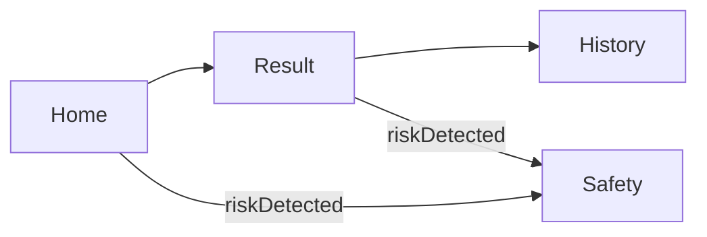

# 아띠(Atti) 서비스 디자인 가이드 & 디자인 시스템

> 본 문서는 아띠 MVP 기획안 및 개발 시작 가이드를 기반으로 작성된 **실무용 서비스 디자인 가이드**야.  
> 말투는 항상 친구 같은 반말 톤을 유지하고, 안전 UX 기준을 엄격히 적용해.

---

## 목차
1. 브랜드 & 캐릭터 가이드
2. 디자인 원칙 (최대 5)
3. Atti Character System
4. 표정 라이브러리 (12종)
5. 포즈/상태 (6종)
6. 에셋 패키지
7. UI 적용 규칙 (화면별)
8. Motion 가이드 (최대 3)
9. 디자인 시스템 토큰
10. 컴포넌트 가이드
11. 화면별 와이어프레임
12. 사용자 여정/화면 흐름도 (Mermaid)
13. 위기(정신건강) 안전 UX 규칙
14. 구현 힌트 (Tailwind)
15. 런칭 전 디자인 체크리스트

---

## 1. 브랜드 & 캐릭터 가이드

### 1-1. 아띠 캐릭터 성격 키워드 (3~5)
- 다정함
- 포근함
- 안정감
- 친근함
- 똑똑함(과한 권위감 없이)

### 1-2. 말투 규칙
- **반말/친구 말투 고정**
- 이모지는 1~2개까지, 과다 사용 금지
- 감정 공감 → 행동 제안 → 안전 안내 순서 유지

### 1-3. 금지 톤
- 훈계, 평가, 냉소, 과잉 확신, 의학적 단정
- 죄책감 유발 (“왜 그렇게 했어?”)
- 가스라이팅/감정 무시 (“그건 별거 아니야”)

### 1-4. 마이크로카피 (화면별 최소 5개)
#### Home
- “아띠에게 오늘을 말해봐”
- “지금 마음을 그대로 적어줘”
- “컨디션은 선택이야, 안 적어도 괜찮아”
- “감정 강도는 가볍게 조절해줘”
- “아띠에게 보내기”
- 오류: “앗, 너무 짧아. 조금만 더 써줄래?”
- 로딩: “아띠가 마음을 읽는 중이야…”

#### Result
- “오늘 너의 마음이 이렇게 보였어”
- “핵심 요약: 너는 지금 이런 상황이야”
- “아띠의 한마디”
- “지금 딱 하기 좋은 작은 행동”
- “완료!”
- “기록에 저장”
- 오류: “분석이 잠깐 멈췄어. 다시 해볼까?”

#### History
- “최근 7일 마음 흐름”
- “오늘도 기록이 쌓였어”
- “한 줄 요약”
- “자세히 보기”
- 빈 상태: “아직 기록이 없어. 첫 일기부터 써볼래?”

#### Safety
- “지금 혼자가 아니야”
- “바로 도움 받을 수 있는 곳”
- “잠깐 숨 고르고, 가까운 사람에게 연락해도 돼”
- “이 앱은 의료적 진단/치료를 대신하지 않아”
- “1393에 바로 전화하기”

#### Settings
- “데이터 백업”
- “복원하기”
- “개인정보 처리방침”
- “앱 정보”
- 완료 토스트: “저장 완료!”

---

## 2. 디자인 원칙 (최대 5)
1. **정서 안전 우선**: 파스텔과 둥근 형태로 시각적 긴장을 낮추고, 조심스럽고 따뜻한 언어로 심리적 안전감을 높여.
2. **귀여움은 신뢰를 방해하지 않게**: 과한 유아성은 배제하고, 부드러운 대비와 절제된 모션으로 차분함을 유지해.
3. **행동으로 이어지는 공감**: 공감 문구 다음에 바로 행동 제안을 배치해 “위로→실행” 흐름을 고정.
4. **작고 빠른 완료 경험**: 5~15분 내 행동을 강조하고, 체크 애니메이션으로 성취감을 짧게 제공해.
5. **모바일 우선 + 접근성**: 터치 영역 44px 이상, 대비 기준 유지, 집중 흐름을 끊지 않는 레이아웃.

---

## 3. Atti Character System

### 3-1. 캐릭터 콘셉트
- **한 줄:** “마음을 담아주는 작은 친구형 로봇 화분”
- **키워드 5개:** 포근함, 안전함, 둥글둥글, 친근함, 차분함

### 3-2. 실루엣/비율 규칙
- 전체 비율: 가로 1 : 세로 1.1
- **얼굴창(크림 창) 비율**: 바디 높이의 55%
- **바디(헬멧)**: 전체 높이의 70%
- **캡(흙 뚜껑)**: 전체 높이의 12%
- **잎**: 전체 높이의 10%, 1잎만

### 3-3. 라인 규칙
- 외곽선 두께: 2.5px(앱 내 기본 아이콘 기준 48px)
- 모서리 라운드: 12px 이상
- 금지: 각진 모서리, 얇은 1px 외곽선, 디테일 과다

### 3-4. 얼굴 규칙
- **눈 크기**: 기존 빅아이 대비 2배
- **눈 간격**: 눈 너비의 1.2배
- **하이라이트**: 2개(큰 1, 작은 1), 눈 상단 우측
- **윙크**: `<` 모양(2획), 각도 15~20도
- **입**: 작은 ‘w’ 기본, 변형은 ‘o’/물결/‘u+혀’만 사용
- **코 없음**

### 3-5. 캐릭터 컬러 토큰 (HEX)
- Atti Shell Green: `#BFE6D2`
- Face Cream: `#FFF4DA`
- Soil Brown: `#9C7A5E`
- Leaf Green: `#7BCB96`
- Ink: `#3A3342`
- Blush: `#F4A9B8`
- Indicator Yellow: `#F7D27C`
- Highlight White: `#FFFFFF`
- 추천 배경(라이트): `#FAF8FF`
- 추천 서피스: `#FFFFFF`

### 3-6. 상태별 표현 강도
- 기본: 볼 1, 하이라이트 2, 모션 약하게
- 기쁨/축하: 볼 2, 반짝 1개
- 슬픔/불안: 볼 0~1, 하이라이트 1개
- **Safety 상태**: 볼 0, 하이라이트 1개, 모션 거의 없음

### 3-7. Do / Don’t
- Do: 둥근 실루엣, 작은 손발, 단순한 디테일
- Do: 안전/차분한 표정, 과도한 치아/혀 디테일 금지
- Don’t: 과한 유아체(큰 이빨, 과한 토끼귀), 공격적 표정
- Don’t: 과도한 반짝/흔들림 모션

---

## 4. 표정 라이브러리 (12종)
> 모든 항목은 축소(24px)에서도 핵심 요소 1개가 유지되도록 설계해.

1) **기쁨 Joy**
- 키: `atti_emotion_joy`
- 설명: 밝고 안정된 즐거움
- 눈: 반달 + 하이라이트 2
- 입: 작은 ‘w’
- 볼: 2
- 추가: 작은 반짝 1
- 축소 핵심: 반달 눈

2) **설렘/신남 Excited**
- 키: `atti_emotion_excited`
- 설명: 에너지 있는 반짝임
- 눈: 크게 열린 원형 + 하이라이트 2
- 입: 물결
- 볼: 2
- 추가: 반짝 2(작게)
- 축소 핵심: 큰 동그란 눈

3) **평온 Calm**
- 키: `atti_emotion_calm`
- 설명: 차분하고 안정됨
- 눈: 작은 반달
- 입: 작은 ‘u’
- 볼: 1
- 추가: 없음
- 축소 핵심: 작은 반달 눈

4) **감사 Gratitude**
- 키: `atti_emotion_gratitude`
- 설명: 따뜻한 감사 표현
- 눈: 반달 + 하이라이트 1
- 입: 작은 ‘w’
- 볼: 2
- 추가: 작은 하트 1
- 축소 핵심: 하트 1개

5) **슬픔 Sad**
- 키: `atti_emotion_sad`
- 설명: 내려앉은 마음
- 눈: 처진 타원 + 하이라이트 1
- 입: 작은 ‘u’(아래로)
- 볼: 0
- 추가: 작은 눈물 1
- 축소 핵심: 눈물 1개

6) **외로움 Lonely**
- 키: `atti_emotion_lonely`
- 설명: 조용히 고립된 느낌
- 눈: 작은 점 + 하이라이트 1
- 입: 작은 ‘o’
- 볼: 0
- 추가: 없음
- 축소 핵심: 작은 ‘o’ 입

7) **불안 Anxiety**
- 키: `atti_emotion_anxiety`
- 설명: 마음이 흔들리는 상태
- 눈: 큰 타원, 동공 아래로
- 입: 작은 물결
- 볼: 0
- 추가: 땀방울 1
- 축소 핵심: 땀방울

8) **초조 Nervous**
- 키: `atti_emotion_nervous`
- 설명: 조급하고 긴장됨
- 눈: 약간 크게 뜬 눈 + 하이라이트 1
- 입: 작은 ‘o’
- 볼: 0
- 추가: 흔들림 표시 1
- 축소 핵심: 작은 ‘o’ 입

9) **분노 Anger**
- 키: `atti_emotion_anger`
- 설명: 강한 불쾌감
- 눈: 좁아진 눈 + 살짝 아래로
- 입: 작은 물결(윗방향)
- 볼: 0
- 추가: 작은 번개 1
- 축소 핵심: 좁아진 눈

10) **짜증 Irritated**
- 키: `atti_emotion_irritated`
- 설명: 가벼운 불쾌감
- 눈: 반달 + 살짝 아래
- 입: 작은 물결
- 볼: 0
- 추가: 없음
- 축소 핵심: 물결 입

11) **무기력 Numb/Tired**
- 키: `atti_emotion_numb`
- 설명: 에너지 저하
- 눈: 작은 점(아래 위치)
- 입: 작은 ‘u’
- 볼: 0
- 추가: 없음
- 축소 핵심: 작은 점 눈

12) **당황 Embarrassed**
- 키: `atti_emotion_embarrassed`
- 설명: 민망하고 얼굴이 붉어짐
- 눈: 크게 뜬 눈 + 하이라이트 2
- 입: 작은 ‘o’
- 볼: 3
- 추가: 없음
- 축소 핵심: 강한 볼

---

## 5. 포즈/상태 6종
1) 로딩(생각 중)
- 사용: Home, Result 로딩
- 모션: 숨쉬기(느린 상하 2px)
- Do: 눈은 위쪽 바라보기
- Don’t: 과한 손 흔들기

2) 응원(파이팅)
- 사용: Result, History
- 모션: 통통 1회
- Do: 작은 손 쥐기
- Don’t: 과한 입 벌림

3) 공감(토닥)
- 사용: Result 공감 섹션
- 모션: 느린 손 움직임
- Do: 볼은 1 이하
- Don’t: 과한 반짝

4) 축하(반짝)
- 사용: Action Item 완료
- 모션: 반짝 200ms
- Do: 짧게 한 번만
- Don’t: 연속 반짝

5) 조언(가이드)
- 사용: Result 조언 섹션
- 모션: 고개 2도 기울임
- Do: 안정된 눈 모양
- Don’t: 과한 윙크

6) 위기(Safety 전환)
- 사용: Safety 전환/화면
- 모션: 거의 없음
- Do: 차분한 눈, 볼 0
- Don’t: 큰 웃음, 반짝

---

## 6. 에셋 패키지

| 항목 | 규칙 |
|---|---|
| 파일 포맷 | SVG 기본, PNG 백업 |
| 사이즈 세트 | 24 / 32 / 48 / 96 / 256 |
| 네이밍 | `atti/emotions/atti_emotion_joy.svg`, `atti/poses/atti_pose_loading.svg` |
| 다크모드 | MVP에서는 불필요. 추후 대비 토큰 추가 시 도입 |
| Export 체크리스트 | stroke→outline, viewBox 정렬, 픽셀 스냅, 투명 배경 |

---

## 7. UI 적용 규칙 (화면별)
- Home: 친근/기대 표정, 과한 반짝 금지
- Result: 감정 배지와 1:1 대응, 완료 시 미세 축하
- History: 작은 스탬프처럼 단순화
- Safety: 차분/절제, 하이라이트 최소
- Settings: 중립/안내 톤

---

## 8. Motion 가이드 (최대 3)
- **통통**: 120ms, scale 1.0→1.05→1.0
- **반짝**: 180ms, opacity 0→1→0
- **숨쉬기**: 1200ms, y -2px→0

---

## 9. 디자인 시스템 토큰

### 9-1. 팔레트 A/B 비교
#### 팔레트 A: 핑크-민트
- 대표 HEX: `#F8B7C7` `#FFDCE5` `#BEEAD9` `#9ED7C2` `#FFF6F8`
- 분위기: 다정/생기/귀여움 강조
- 위험 요소: 채도 과다 → 피로감
- 방지 규칙: 핫핑크 텍스트 금지, 포인트만 사용

#### 팔레트 B: 라일락-버터옐로 (최종 선택)
- 대표 HEX: `#C8B6FF` `#B8C0FF` `#FFDFA0` `#FFF1CC` `#F6F0FF`
- 분위기: 차분/몽글/신뢰감
- 위험 요소: 노란 배경 위 텍스트 가독성 저하
- 방지 규칙: 노란 배경 위 텍스트는 `#3A3342`만 사용

### 9-2. Color Tokens (HEX)
- Primary: `#C8B6FF` (Lilac)
- Secondary: `#FFDFA0` (Butter)
- Accent: `#BEEAD9` (Mint)
- Background: `#FAF8FF`
- Surface: `#FFFFFF`
- Text Primary: `#3A3342`
- Text Secondary: `#6B6477`
- Border: `#E8E2F5`
- Success: `#8BD3B8`
- Warning: `#F6C87A`
- Danger: `#F28B8B`
- Info: `#8BB7F2`

#### Emotion Badge Palette (6+)
- Joy: `#FFE08A`
- Sad: `#B7C9F2`
- Anxiety: `#F6C0C9`
- Anger: `#F4A6A6`
- Calm: `#BEEAD9`
- Numb: `#D6D2E8`
- Gratitude: `#FFD9B3`
- Excited: `#C9F0FF`

#### 대비 규칙
- 파스텔 배경 위 텍스트는 **항상** `Text Primary`
- `Secondary` 위 `Text Secondary` 금지
- 감정 배지 내부 텍스트는 `#3A3342` 고정

### 9-3. Typography
- 후보: **Pretendard**, **SUIT**, **Noto Sans KR**
- 추천: Pretendard (가독성/상업 사용 안정)

| 역할 | 크기 | 굵기 | 라인 높이 |
|---|---|---|---|
| H1 | 28px | 700 | 36px |
| H2 | 22px | 600 | 32px |
| H3 | 18px | 600 | 28px |
| Body | 15px | 400 | 24px |
| Caption | 12px | 400 | 18px |

규칙:
- 배지 텍스트는 12~13px
- 버튼은 15~16px, 600
- 요약문은 Body 15px, 1~3줄

### 9-4. Layout & Spacing
- 모바일 기준 폭: 360px
- 브레이크포인트: 768 / 1024 / 1280
- 스페이싱: **8px 시스템**
- 기본 패딩: 16px
- 섹션 간격: 24px
- 카드 간격: 12~16px
- 최대 컨텐츠 폭: 720px (데스크탑)

### 9-5. Radius / Shadow / Motion
- Radius:
  - 버튼 14px
  - 입력 16px
  - 카드 20px
  - 모달 24px
- Shadow:
  - Soft-1: `0 2px 8px rgba(58,51,66,0.08)`
  - Soft-2: `0 6px 16px rgba(58,51,66,0.10)`
  - Soft-3: `0 10px 24px rgba(58,51,66,0.12)`
- Motion:
  - 전환 180ms ease-out
  - 로딩 1200ms breathing
  - 체크 200ms sparkle

### 9-6. Icon & Illustration Style
- 라운드 라인, 두께 2px
- 끝처리: 완전 둥근 캡
- 감정 배지 규칙:
  - 눈 위치: 얼굴 상단 45%
  - 입 위치: 눈 아래 20%
  - 표정 강도 3단계 (약/중/강)
  - 배경: 둥근 블랍 1개만 사용
- 아띠 요소:
  - 로딩/빈 상태에만 작은 캐릭터 사용
  - 상단 바/네비에는 스티커 1개 이하

---

## 10. 컴포넌트 가이드

### 10-1. Top App Bar
| 항목 | 내용 |
|---|---|
| 목적 | 날짜/타이틀 표시 |
| Props | `title`, `date`, `rightAction?` |
| 사이즈 | sm/md/lg |
| 상태 | default |
| 접근성 | 타이틀 22px, 대비 4.5:1 |
| 예시 | “1월 21일 · 아띠에게 오늘을 말해봐” |

### 10-2. Bottom Navigation
| 항목 | 내용 |
|---|---|
| 목적 | Home/History/Settings 이동 |
| Props | `items`, `activeKey` |
| 사이즈 | md |
| 상태 | default/active |
| 접근성 | 아이콘+텍스트, 터치 44px |
| 예시 | “홈/기록/설정” |

### 10-3. Textarea (일기 입력)
| 항목 | 내용 |
|---|---|
| 목적 | 자유로운 감정 기록 |
| Props | `value`, `placeholder`, `maxLength` |
| 사이즈 | md/lg |
| 상태 | default/focus/error |
| 접근성 | placeholder 대비 3:1, 44px |
| 예시 | “오늘 있었던 일과 마음을 적어줘” |

### 10-4. Select/Tag/Slider
| 항목 | 내용 |
|---|---|
| 목적 | 컨디션/태그/강도 선택 |
| Props | `options`, `value`, `onChange` |
| 사이즈 | sm/md |
| 상태 | default/selected/disabled |
| 접근성 | 키보드 탐색 가능 |
| 예시 | “컨디션: 보통 / 태그: #학교” |

### 10-5. Button (Primary/Secondary/Ghost/Destructive)
| 항목 | 내용 |
|---|---|
| 목적 | 주요 행동 트리거 |
| Props | `variant`, `loading`, `disabled` |
| 사이즈 | sm/md/lg |
| 상태 | default/hover/pressed/disabled/loading |
| 접근성 | 44px, 포커스 링 2px |
| 예시 | “아띠에게 보내기 / 기록에 저장” |

### 10-6. Emotion Badge
| 항목 | 내용 |
|---|---|
| 목적 | 감정 라벨+강도 표시 |
| Props | `emotion`, `score`, `size` |
| 사이즈 | sm/md |
| 상태 | default |
| 접근성 | 텍스트 대비 4.5:1 |
| 예시 | “슬픔 0.8” |

### 10-7. Summary Block
| 항목 | 내용 |
|---|---|
| 목적 | 핵심 사건 1~3줄 요약 |
| Props | `summary` |
| 사이즈 | md |
| 상태 | default |
| 접근성 | 15px, line-height 24 |
| 예시 | “오늘 너는 관계에서 서운함을 느꼈어.” |

### 10-8. Response Section
| 항목 | 내용 |
|---|---|
| 목적 | 공감/조언 메시지 |
| Props | `empathy`, `advice` |
| 사이즈 | md |
| 상태 | default |
| 접근성 | 읽기 쉬운 줄간격 |
| 예시 | “그 감정은 너무 자연스러워.” |

### 10-9. Action Item Card
| 항목 | 내용 |
|---|---|
| 목적 | 실행 가능한 행동 제안 |
| Props | `category`, `title`, `description` |
| 사이즈 | md |
| 상태 | default/checked |
| 접근성 | 체크 버튼 44px |
| 예시 | “🎵 음악 추천 / 🛍️ 쇼핑 아이템 / 🌳 자연 활동” |

### 10-10. “완료!” 체크 버튼
| 항목 | 내용 |
|---|---|
| 목적 | 행동 완료 체크 |
| Props | `checked` |
| 사이즈 | sm |
| 상태 | default/checked |
| 접근성 | aria-pressed |
| 예시 | “완료!” |

### 10-11. Evidence Card
| 항목 | 내용 |
|---|---|
| 목적 | 추천 근거/링크 표시 |
| Props | `source`, `summary`, `link?` |
| 사이즈 | md |
| 상태 | default |
| 접근성 | 링크는 명확한 라벨 |
| 예시 | “근거: 음악 치료가 우울 감소에 도움” |

### 10-12. Toast/Alert
| 항목 | 내용 |
|---|---|
| 목적 | 저장/오류 안내 |
| Props | `type`, `message` |
| 사이즈 | sm |
| 상태 | success/error |
| 접근성 | 3초 자동 닫힘 |
| 예시 | “저장 완료!” |

### 10-13. Modal
| 항목 | 내용 |
|---|---|
| 목적 | 삭제/백업 확인 |
| Props | `title`, `content`, `actions` |
| 사이즈 | md |
| 상태 | default |
| 접근성 | 포커스 트랩 |
| 예시 | “정말 삭제할래?” |

### 10-14. Chart/Calendar (History)
| 항목 | 내용 |
|---|---|
| 목적 | 7일 감정 트렌드 + 이모지 캘린더 |
| Props | `data`, `range` |
| 사이즈 | md |
| 상태 | default |
| 접근성 | 캘린더 날짜 텍스트 제공 |
| 예시 | “최근 7일 흐름” |

---

## 11. 화면별 와이어프레임

### 11-1. Home (일기 작성)
- 목표: 편하게 기록하고 제출
- 정보 구조: 날짜/타이틀 → 입력 → 선택필드 → CTA → 네비

```
┌─────────────────────────────┐
│ 1월 21일  아띠에게 오늘을 말해봐 │
├─────────────────────────────┤
│ [일기 입력 영역.............] │
│ [..........................] │
│ [..........................] │
│ 컨디션 ▾  태그 ▾  강도 ▾      │
│ [ 아띠에게 보내기 ]          │
├─────────────────────────────┤
│ 홈  기록  설정              │
└─────────────────────────────┘
```
- 상호작용: 입력 → CTA 제출 → Result
- 상태:
  - 빈 상태: “지금 마음을 적어줘”
  - 오류: “조금 더 자세히 써줄래?”
  - 로딩: “아띠가 마음을 읽는 중이야…”
- 반응형: 데스크탑에서 입력 영역 2컬럼(입력/선택필드)

### 11-2. Result (분석 결과)
- 목표: 감정 이해 + 행동 선택
- 정보 구조: 감정 배지 → 요약 → 공감/조언 → 액션 카드 → 저장

```
┌─────────────────────────────┐
│ [감정 배지 x3~5]             │
│ 한 줄 요약                  │
│ 아띠의 공감/조언             │
│ ┌액션 카드 1 (음악)──[완료!]│
│ ├액션 카드 2 (쇼핑)──[완료!]│
│ └액션 카드 3 (활동)──[완료!]│
│ [ 기록에 저장 ]             │
└─────────────────────────────┘
```
- 상호작용: 완료 체크 → 미세 축하
- 상태: 로딩 “분석 중…”, 오류 “다시 시도할래?”
- 반응형: 데스크탑 2컬럼(요약/조언 + 액션 카드)

### 11-3. History (기록)
- 목표: 지난 기록 탐색
- 정보 구조: 7일 트렌드 → 캘린더 → 카드 리스트

```
┌─────────────────────────────┐
│ 최근 7일 마음 흐름           │
│ [이모지 캘린더/트렌드]        │
│ ┌카드: 1/20  슬픔  한줄요약  │
│ ├카드: 1/19  평온  한줄요약  │
│ └카드: 1/18  불안  한줄요약  │
└─────────────────────────────┘
```
- 상호작용: 카드 클릭 → 상세
- 빈 상태: “첫 기록을 만들어볼까?”
- 반응형: 캘린더 좌, 리스트 우

### 11-4. Safety (위기 안내)
- 목표: 즉시 도움 안내
- 정보 구조: 긴급 연락처 → 가이드 → 면책

```
┌─────────────────────────────┐
│ 지금 혼자가 아니야           │
│ 1393 전화하기                │
│ 정신건강복지센터 안내         │
│ 지금 할 수 있는 것 3가지     │
│ 면책 문구                    │
└─────────────────────────────┘
```
- 상호작용: 전화/기관 버튼
- 상태: 항상 단순/차분
- 반응형: 중앙 정렬, 버튼 크게

### 11-5. Settings (설정)
- 목표: 데이터 관리
- 정보 구조: 백업/복원 → 개인정보 → 앱정보

```
┌─────────────────────────────┐
│ 데이터 백업                  │
│ 데이터 복원                  │
│ 개인정보 처리방침            │
│ 앱 정보                      │
└─────────────────────────────┘
```
- 상호작용: 백업/복원 모달
- 상태: 완료 토스트 “저장 완료!”
- 반응형: 리스트 폭 560px 고정

---

## 12. 사용자 여정/화면 흐름도 (Mermaid)



---

## 13. 위기(정신건강) 안전 UX 규칙
- 위험 신호 감지 시 **일반 조언/추천 중단** → Safety 우선 전환
- Safety 화면 톤: 짧고 따뜻하게, 단정 금지
- 금지 표현: “무조건 괜찮아질 거야”, “너가 잘못했어”, “별거 아니야”
- 도움 리소스 버튼: 전화/기관 카드로 큰 터치 영역
- 면책 문구:
  - 짧은 버전: “이 앱은 의료적 진단/치료를 대신하지 않아”
  - 긴 버전: “이 앱은 정보 제공을 위한 도구이며 전문 치료를 대체하지 않아”

---

## 14. 구현 힌트 (Tailwind)
- 토큰 적용: `:root` CSS 변수 + `tailwind.config` 확장
- shadcn/ui 톤 통일: `rounded-[14px]`, `shadow-sm`, `bg-surface`
- 클래스 패턴:
  - Primary 버튼: `bg-primary text-textPrimary hover:bg-primary/90`
  - 카드: `bg-surface border border-border rounded-2xl shadow-sm`
  - 배지: `rounded-full px-3 py-1 text-xs`

---

## 15. 런칭 전 디자인 체크리스트 (15)
1. 모든 텍스트 대비 4.5:1 이상
2. 터치 타겟 44px 이상
3. 로딩/에러/빈 상태 문구 존재
4. Safety 전환 우선순위 확인
5. 감정 배지 3~5개 표시
6. 액션 카드 3~5개 노출
7. 완료 체크 애니메이션 1회
8. 하단 네비 고정
9. 타이포 스케일 일관성
10. 카드 간격 12~16px 유지
11. 캐릭터 사용 과하지 않음
12. 감정 배지 축소 시 식별 가능
13. 저장 성공 토스트 노출
14. 개인정보/면책 문구 노출
15. 데스크탑 레이아웃 재배치 확인

